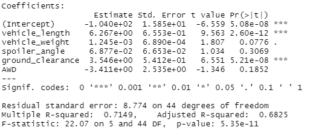
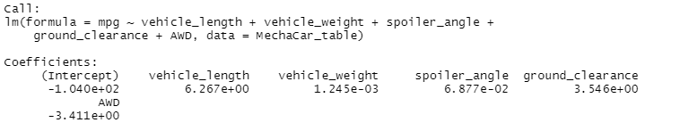
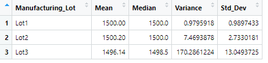
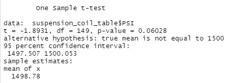
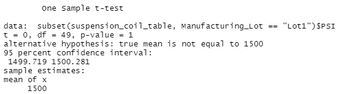
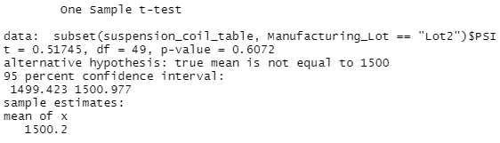
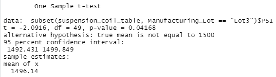

# MechaCar_Statistical_Analysis

## Linear Regression to Predict MPG

- Which variables/coefficients provided a non-random amount of variance to the mpg values in the dataset?

The variables that best predict mpg values in the dataset are vehicle length and ground clearance.  With a p-value if 2.60e-12 for vehicle length, which is less than alpha level of 0.05, we reject the null.  There is evidence to suggest there is some relationship between mpg and vehicle length.  With a p-value of 5.21e-08 for ground clearance, which is less than alpha level of 0.05, we reject the null.  There is evidence to suggest there is some relationship between mpg and ground clearance.  

- Is the slope of the linear model considered to be zero? Why or why not?

Since there is some type of relationship happening between mgp and at least one other variables, the slope of the  model would not be zero.  If the slope was zero, then we would expect to see no relatioship happening between mpg and any variable.  

- Does this linear model predict mpg of MechaCar prototypes effectively? Why or why not?

This model does predict mpg of MechaCar prototypes effectively since it has a large R-squared value.  R-square is equal to .7149, which means that 71.49% of the variability in vehicle variables can be accounted for in the regression line using mpg.  

## Summary Statistics on Suspension Coils

- The design specifications for the MechaCar suspension coils dictate that the variance of the suspension coils must not exceed 100 pounds per square inch. Does the current manufacturing data meet this design specification for all manufacturing lots in total and each lot individually? Why or why not?

As a whole dataset, the variance of the suspension coils do not exceed 100 pounds per square inch, it is 62.29356. 

When the cars are broken down into the three lots and then analyized with summary statistics, Lot 1 and Lot 2 are still under the variance of 100 pounds per square inch.  However, Lot 3 is well above the 100 pounds per square inch, with a variance of 170.2861224.  

## T-Tests on Suspension Coils

### T-Test on Total Summary

Let Ho: mu=1500  and Ha: m != 1500
With a p-value of .06028, which is greater than the alpha level of 0.05, we fail to reject the null.  There is no evidence to suggest that the true mean is different than mu=1500 pounds per square inch.  

When the data is broken down by lot numbers, we can see there is a different story to tell.  For each lot, we will use Ho: mu=1500 and Ha: mu != 1500.

#### Lot 1

With a p-value of 1, which is greater than the alpha level of 0.05, we fail to reject the null.  There is no evidence to say that the mean PSI is any different than 1500 pounds per square inch in lot 1.  

#### Lot 2

With a p-value of 0.6072, with is greater than alpha level 0.05, we fail to reject the null.  There is no evidence to say that the mean PSI is any different than 1500 pounds per square inch in lot 2.  

#### Lot 3

With a p-value of 0.04168, which is less than alpha level 0.05, we reject the null.  There is evidence to suggest that the mean PSI in Lot 3 is different than 1500 pounds per square inch.  

## Study Design: MechaCar vs Competition

- What metrics or metices are you going to test?

When people shop for new cars, there are a few different variables that are considered.  Two of the most popular variables is fuel efficiency (city or highway) and safety rating.  People want to make sure they can get the mileage, especially since gas prices are constantly fluctuating and have been increasing more often then dropping.  People always want to make sure that they, and their families, are safe when traveling in the car.  

- What is the null hypothesis or alternative hypothesis?

When we test for fuel efficiency, it may be best to separate the city and highway into two different groups.  
For the city: Ho: mean city mpg of MechaCar = mean city mpg of competition   and Ha: mean city mpg of MechaCar > mean city mpg of competition   We would want to see if MechaCar can get a better city mileage than other cars, making it a better choice.

For the highway, we would set up our hypothesese the same way, replacing city with highway.  

When we want to test the safety rating, we would want our Ho: MechaCar mean safety rating = Competition mean safety rating   and Ha: MechaCar mean safety rating > Competition mean safety rating.  Again, we would want to test to see if the safety rating is lower for other cars, making MechaCar the better option.  

- What statistical test would you use to test the hypthesis? And why?

For testing city and highway fuel efficiency, we would need to perform a two-sample T Test between MechaCar and each individual competitor.  Depending on how many competitiors need to be tested/compared, if there is a large number of competitiors it may be best to perform an ANOVA test instead.  

For safety rating it may be best to use a Chi-Square test for homogenity to see if the ratings are the same across all companies or if they are different.  The Chi-Square test may not be able to tell us which ones are different, but could be a starting point if whether there is a difference that can be investigated further.  

- What data is needed to run the statistical test?

The data needed to run these tests would the fuel efficiency broken down by city and highway for MechaCar as well as any other competition.  We would also need to know safety ratings of all cars involved.  Safety rating is most likely used as a categorical variables in this case, so it may need to be converted to categories or bins to run the chi-square test (such as rating 0-2: not safe, 2.1-4: moderately safe, 4.1-6: safe, etc. )

